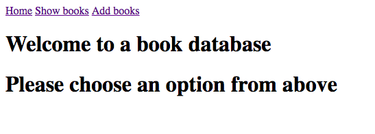
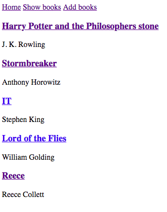
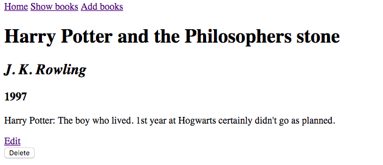
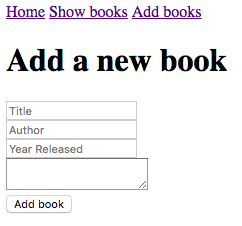
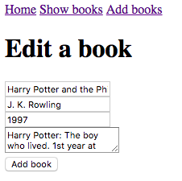

# Web Application Start Homework

## Requirements
- [x] Working web application
- [x] Use the 7 RESTful routes
- [x] Use resources that are different from the lesson resources
- [x] Add forms that add information to a hash array
- [x] Meet the definition of done

## Result

### Home Screen

### Show all books

### Show a single book

### Add form

### Edit form

